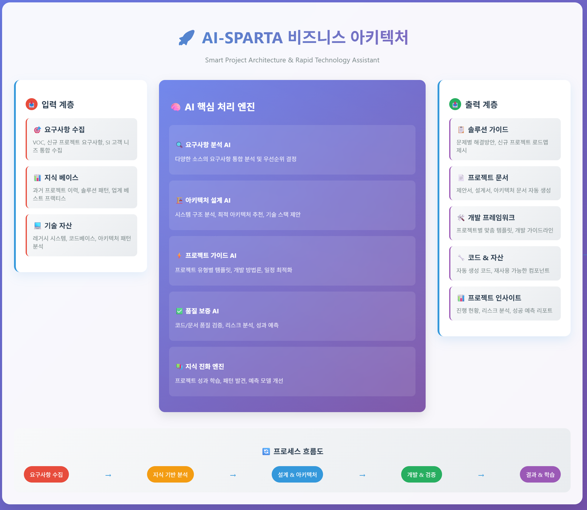

# ktds-mvp-mrnam



## 프로젝트 제목

**"AIDEV-OPS: AI-Driven Development Operations & Quality Assurance Platform"**
(AI 기반 개발 운영 및 품질보증 통합 플랫폼)

**"AI-SPARTA: Smart Project Architecture & Rapid Technology Assistant"**

(스마트 프로젝트 아키텍처 및 신속 기술 지원 플랫폼)

## 거버닝 메시지

### 프로젝트 비전

"VOC 기반 지능형 개발 생명주기 관리를 통해 개발 품질 향상과 업무 효율성을 극대화하는 차세대 개발 지원 플랫폼 구축"

### 핵심 가치

- **지속적 학습**: VOC 패턴 분석을 통한 누적 지식 체계 구축
- **예방적 품질관리**: 사전 가이드 제공으로 결함 최소화
- **자동화 중심**: 반복 업무 자동화를 통한 개발자 생산성 향상
- **표준화 준수**: 일관된 개발 표준 적용으로 코드 품질 보장

### 성공 지표

- VOC 해결 시간 70% 단축
- 코드 품질 지표 30% 향상
- 개발 가이드 준수율 95% 달성
- 반복 문제 발생률 50% 감소

## 핵심 설계 포인트

### 1. 데이터 기반 의사결정

- VOC 패턴 분석을 통한 예측적 문제 해결
- 누적 지식 기반 솔루션 데이터베이스 구축
- 실시간 학습을 통한 AI 모델 지속 개선

### 2. 개발 생명주기 통합 관리

- 요구사항 → 설계 → 개발 → 품질검증의 seamless 연계
- 각 단계별 AI 지원으로 품질 일관성 확보
- 표준화된 템플릿과 가이드라인 자동 적용

### 3. 확장 가능한 플랫폼 구조

- 모듈형 AI 엔진으로 기능별 독립적 확장 가능
- API 기반 외부 시스템 연동 지원
- 클라우드 네이티브 아키텍처 적용


## 1. 코드 품질 모니터링 시스템 개요 및 목적

**목적**:

SI/SM 프로젝트 개발 및 유지보수 진행 시 
기업의 개발 표준(코딩 명명규칙, 패키지 구조, 주석 방식 등)에 대해 개발된 소스코드가 실제로 잘 준수되고 있는지를 **자동으로 검수**하고, **GenAI 기반으로 문제를 분석 및 조치방안을 제안**하여, 개발자에게 이메일/문자로 전송하는 **AI 기반 코드 품질 모니터링 자동화 시스템**을 구축.

**핵심 기능**:

- 회사별 개발 표준을 RAG 방식으로 학습
- Git 저장소에서 commit 발생 시 주기적 소스코드 검사
- AI로 문제점 분석 및 수정안 자동 작성
- 결과를 이메일/SMS로 개발자에게 전송

---

## 2. 활용 기술 및 Azure 서비스

| 목적 | 기술 | Azure 서비스 |
| --- | --- | --- |
| Git 연동 및 이벤트 트리거 | GitHub, GitHub Actions | **GitHub + Azure DevOps** |
| 개발 표준 저장소 (RAG 용) | Vector DB + 문서 저장 | **Azure Cognitive Search + Azure Blob Storage** |
| 소스코드 분석 및 LLM 추론 | LLM, Prompt + GenAI | **Azure OpenAI Service (GPT-4o or GPT-4 Turbo)** |
| 소스코드 파싱 및 검수 로직 | Python, Tree-sitter, Regex 등 | **Azure Functions + Azure Container Apps** |
| 문제 분석 및 수정방안 생성 | LLM + 평가 함수 | **Azure OpenAI + Azure Machine Learning** |
| 알림 전송 | 메일, 문자 | **Azure Communication Services** |
| 메시지 큐 처리 및 비동기 실행 | Queue 기반 병렬 작업 | **Azure Service Bus / Azure Event Grid** |
| 모니터링 및 로깅 | 관측성 및 운영 | **Azure Monitor + Application Insights** |

---

## 3. 아키텍처 구조 (Azure 기반)
```
개발 가이드 RAG 학습
┌──────────────┐
│ Azure Storage│────[개발가이드 등록]─┐
└──────────────┘                    │
                                  ▼
                        ┌───────────────────────┐
                        │ Azure AI Search       │
                        │ Azure AI Service(OCR) │
                        └────────┬──────────────┘
                                 ▼
                   ┌────────────────────────────┐
                   │ Vector 데이터 생성 및 저장    │
                   └────────────────────────────┘


```
```
코드 품질 점검
┌────────────┐
│ GitHub     │────[commit 발생]───┐
└────────────┘                    │
                                  ▼
                        ┌────────────────────┐
                        │ GitHub Actions     │
                        │ or Azure DevOps CI │
                        └────────┬───────────┘
                                 ▼
                   ┌────────────────────────────┐
                   │ Azure Function (트리거)     │
                   │  - 소스코드 분석 파이프라인 │
                   └────────┬───────────────────┘
                            ▼
        ┌────────────────────────────┐
        │  Azure Container Apps      │
        │  - RAG 질의 처리           │
        │  - LLM 분석 및 Prompt 생성 │
        └────────┬──────────────────┘
                 ▼
       ┌─────────────────────────────┐
       │ Azure Cognitive Search      │←────Blob Storage (개발표준 문서)
       │ - 개발표준 벡터질의         │
       └────────────┬────────────────┘
                    ▼
           ┌────────────────────┐
           │ Azure OpenAI       │
           │ - 문제 설명 생성   │
           │ - 수정방안 제안   │
           └────────────┬───────┘
                        ▼
         ┌──────────────────────────┐
         │ Azure Communication Svc  │
         │ - 이메일 / 문자 발송     │
         └──────────────────────────┘

```

---

## 4. 기대 효과

| 항목 | 기대 효과 |
| --- | --- |
| **개발 품질 향상** | 개발자들이 무의식적으로 발생시키는 표준 위반을 조기에 발견하고 즉각 피드백 제공 |
| **자동화된 코드 리뷰** | 코드 리뷰 인력 부담 감소, PR 전에 사전 검수 완료 가능 |
| **지속적인 규칙 학습** | 개발 표준 변경 시에도 신속하게 재학습 가능 (RAG 기반) |
| **교육 효과** | 잘못된 코드에 대한 AI의 설명 + 수정 방안을 통해 개발자 학습 효과 발생 |
| **DevSecOps 확장성** | GitOps 기반 파이프라인에 자연스럽게 통합되어 확장성 확보 |

## 5. 고찰 
1. 학습 데이터의 전처리 필요성 
2. prompt 작성의 중요성 
3. KMS 연계를 통한 자동 학습 구현 필요. (Confluence, JIRA, 문서 등)
4. github action을 통한 코드 품질 분석 Trigger 구현 필요
5. 분석 결과 SMS/Email 발송 구현 필요